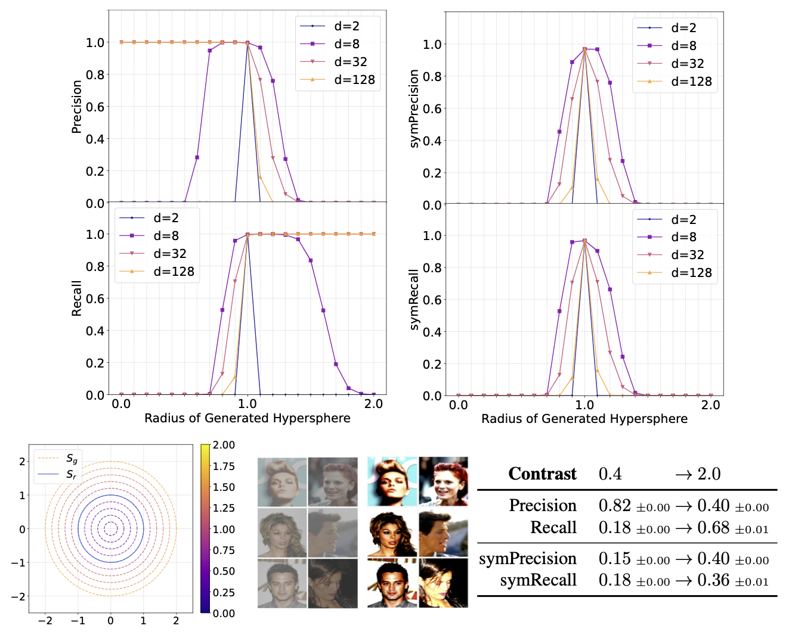

# Emergent Asymmetry of Precision and Recall for Measuring Fidelity and Diversity of Generative Models in High Dimensions
Find our paper at [ICML 2023](https://icml.cc/virtual/2023/poster/23612) and [Arxiv](https://arxiv.org/abs/2306.09618). Please cite the following if using the code:
```
@inproceedings{khayatkhoei2023emergent_asymmetry_pr,
  title={Emergent Asymmetry of Precision and Recall for Measuring Fidelity and Diversity of Generative Models in High Dimensions},
  author={Khayatkhoei, Mahyar and AbdAlmageed, Wael},
  booktitle={International Conference on Machine Learning},
  year={2023},
  organization={PMLR}
}
```

## Setup
This repo uses the conda environment described in the `env.yml` file. To setup the environment, simply install conda and run:
```
conda env create -f env.yml
conda activate py38eapr
```

For experiments based on CelebA dataset, its `jpg` images must be accessible locally at `data/celeba/img_align_celeba`. This can be achieved by downloading the dataset from http://mmlab.ie.cuhk.edu.hk/projects/CelebA.html and symlinking the root directory.

For experiments based on CIFAR10 dataset, its batches must be accessible locally at `data/cifar/cifar-10-batches-py`. This can be achieved by downloading the dataset from https://www.cs.toronto.edu/~kriz/cifar.html and symlinking the root directory.

## Experiments
The experiments of the paper are defined in `run.py`, and can be either imported into a notebook or run directly from the commandline, for example: 
```
python run.py --exp hypersphere_exp --save_dir SAVE_DIR
```
This will create plots and summary json files, corresponding to the hyperspherical support experiment, inside SAVE_DIR. Parameters of each experiment are explained in detail inside `run.py`. To see a list of experiments and other commandline accessible arguments run:
```
python run.py --help
```
Default values are specified in each experiment definition. New experiments can easily be added to run.py following the setup of existing experiments and extending `EXP_DICT`.

## Manifold Metrics
This repo provides the `ManifoldMetric` class for computing all versions of Precision and Recall discussed in the paper. To use this class, first add the `manifmetric` directory to the path and import it:
```
from manifmetric.manifmetric import ManifoldMetric
manif_metric = ManifoldMetric()
```

If the input space must be embedded with a model, pass the model at instantiation (or directly assign a new model to `manif_metric.model`):
```
manif_metric = ManifoldMetric(model=model)
```
then, use `manif_metric.extract_features` to embed the real and generated inputs, for example:
```
data_loader = DataLoader(dataset=dataset, sampler=dataset.test_set, batch_size=batch_size, num_workers=num_workers)
ref_data = manif_metric.extract_features(data_loader, transform=transformer)
```
See the definition of `extract_features` in `manifmetric/manifmetric.py` for a detailed explanation of each argument.

To compute the metrics, first compute stats for reference (real) and generated data under a certain `k` of k-nearest neighbors by calling:
```
manif_metric.compute_ref_stats(ref_data, k=5)
manif_metric.compute_gen_stats(gen_data, k=5)
```
This will compute required stats and assign `manif_metric.ref_stats` and `manif_metric.gen_stats`. Then call the individual metrics as desired:
```
manif_metric.precision()
manif_metric.comp_precision()
manif_metric.sym_precision()
manif_metric.recall()
manif_metric.coverage()
manif_metric.sym_recall()
```
The metrics can also directly receive previously computed ref_stats and gen_stats as input arguments (this will not override manif_metric.ref_stats or manif_metric.gen_stats, but will replace them in the computation of precision at this line):
```
manif_metric.precision(ref_stats, gen_stats)
```
Note that all metrics return a single `float` value except `sym_precision` and `sym_recall`, which will return a dictionary of `float`s containing the other corresponding metrics used in their computation (see their definitions in `manifmetric/manifmetric.py` for more details).

Finally, note that all computations are performed and stored in the dtype and device of ref_data. You can directly cast ref_data to the desired dtype and device before calling `compute_ref_stats`. Since all computations are stored in a single device, to conserve memory you can free up the stored stats when they are no longer needed, for example, before using a new gen_data one could optionally run:
```
del gen_data
manif_metric.gen_stats = None
```

## Datasets
Datasets are defined in `manifmetric/dataset.py`. Each dataset class is expected to implement `dataset.__getitem__`, `dataset.__len__`, and two lists/arrays of int indices `dataset.test_set` and `dataset.train_set` whose elements are data ids that can be given to `dataset.__getitem__` to retrieve either an image or a tuple of (image, label) corresponding to that id. 